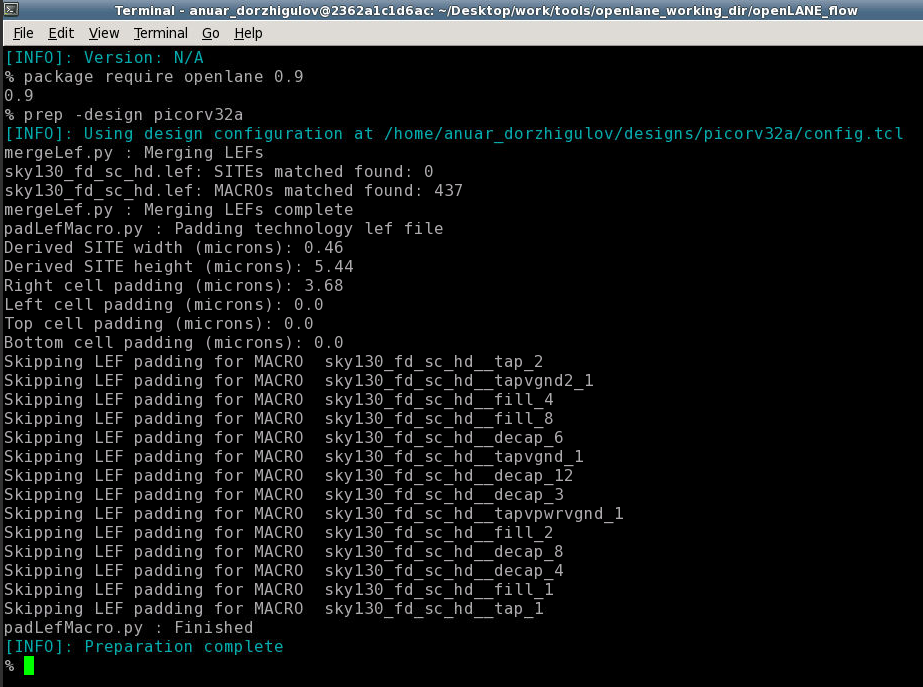

# OpenLANE_SKY130
For OpenLANE/SKY130 workshop 2021

The purpose of this workshop is to introduce audience to the openLANE - an open source flow to for a physical design of electronics. The main purpose of this project is to automate the design flow, from RTL to GDSII.

Currently, this workshop is designed around Skywater 130nm PDK, which was recently was made made open source.

## Day 1
This day is focused on introduction of the OpenLANE as an open source design flow.

OpenLane begins with initialization with `./flow.tcl` command run in main openLANE directory. This command would automatically run all design steps required to get legal GDSII file.

`./flow.tcl -interactive` will run the openLANE session in interactive mode, where each step of a design flow could be adjusted and launched by user.

Next step in interactive flow is `package require openlane 0.9`, which activates packages required for openLANE.

`prep -design picorv32a` will configure the selected cell (_picorv32a_ in this example) for a design by merging required LEF files.

Once the cell LEF file is configured, the cell is ready for Synthesis - one of the first major steps in a design flow.

`run_synthesis` command will launch sysnthesis process in openLANE.

During the synthesis run it can be observed how the cell architecture is automatically configured.

## Day 2
The focus of this day was on floorplan and placement steps of the flow. 

Floorplan stage is required to place pins and non-standart cells on an area of a die.

`run_floorplan` is a command to run this stage. Additional switches can be used to customize the floorplan strategy, such as pin allocation.

Figure below shows the finished floorplan run with default configurations.

Floorplan generates a def file, fragment of which is shown below.

Generated def file allocates mentioned die elements on a grid. Generated configuration can be visualized with _magic_ as a layout. It requires a PDK ***tech*** file, a cell ***lef*** file and a ***def*** file of a floorplan.

Zoomed in view shows placed pin and decoupling capacitors (non standart cell).

The next step is to allocate standard cells by running `run_placement` command. Similiar to a floorplan, the placement run can be customized with additional swithces if neeeded.

A finished placement run with default confogurations and generated magic layout shown below.

## Day 3

Focus of this day is on a custom cell layout and characterization.

_magic_ is a robust tool for layout visualization, design and characterization. For example, it allows to highlight the placed pins on a die, which were generted with custom floorplan configuration.

Moreover, this tool allows to characterize custom cells. Example bellow shows layout of the custom CMOS inverter layout. 

Some basic commands in _magic_ simplifies the operation and characterization of layout components. `what` _magic_ command is used to describe selected layout component, such as nmos.

One of the main features of the _magic_ is a layout parasitics extractions as a ***spice*** file.

_ngspice_ is a circuit simulation tool, which can characterize electrical circuits in ***spice***, so it is a usefull tool to study the parasitics introduced by the layout imperfections. 

Extracted from layout spice file shows numerous sources of parasitic capacitances, so the timing performance of the inverter could be compromised. Capacitive effects could be characterized using transient analysis in spice with _ngspice_.

_ngspice_ point and click GUI is helpful  in estimation of capacitive dependant characteristics, such as delays, rising and falling times.

## Day 4

## Day 5
